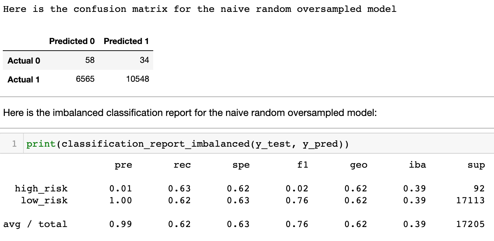
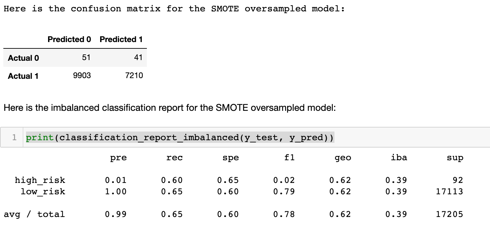
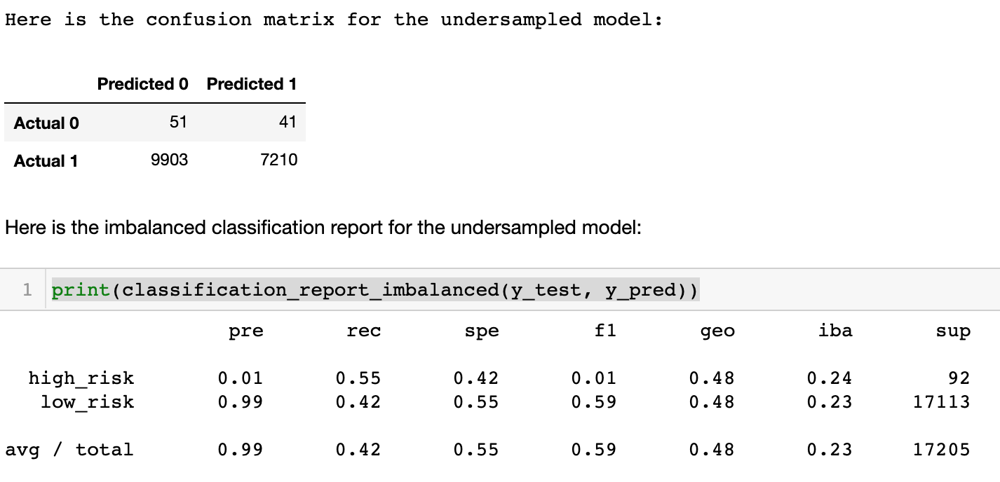
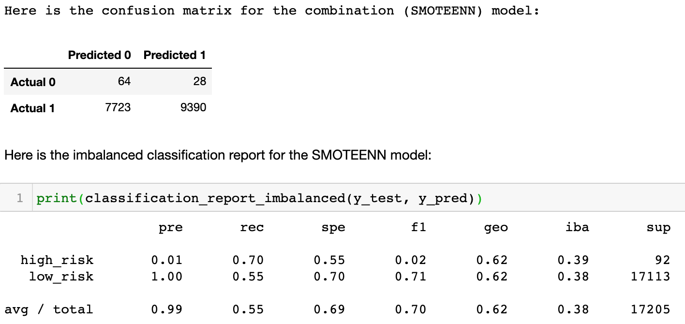

# Credit Risk Evaluation - Supervised Machine Learning
UC Berkeley Extension Data Analytics Boot Camp Module 17

---

## Objectives
The objective of this module was to learn about supervised machine learning algorithms and resampling to attempt to address class imbalances. We used various resampling techniques to determine credit worthiness of various customers. This analysis was done in the *credit_risk_resampling.ipynb* notebook.

## Data
Our data is stored in "LoanStats_2019Q1.csv" in the Resources folder. It houses data from LendingTree for thousands of loan applications. 

## Contents
|Folder|Description|
|------|-----------|
|Resources|Contains data for both the module and challenge notebooks|
|ModuleFiles|Contains notebooks created throughout the module|
|ChallengeFiles|Contains notebooks created for the Challenge portion of the module|
|Images|Screenshots of confusion matrices and reports that are used in the writeup|

---

## Resampling Techniques - (credit_risk_resampling.ipynb)
1) Naive Random Oversampling
2) SMOTE Oversampling
3) Undersampling
4) Combination Sampling (SMOTEENN)

### Naive Random Oversampling

##### Confusion Matrix and Classification Report

---

### SMOTE Oversampling

##### Confusion Matrix and Classification Report

---

### Undersampling

##### Confusion Matrix and Classification Report

---

### Combination Sampling

##### Confusion Matrix and Classification Report

---

### Summary, Analysis, and Recommendation

---

